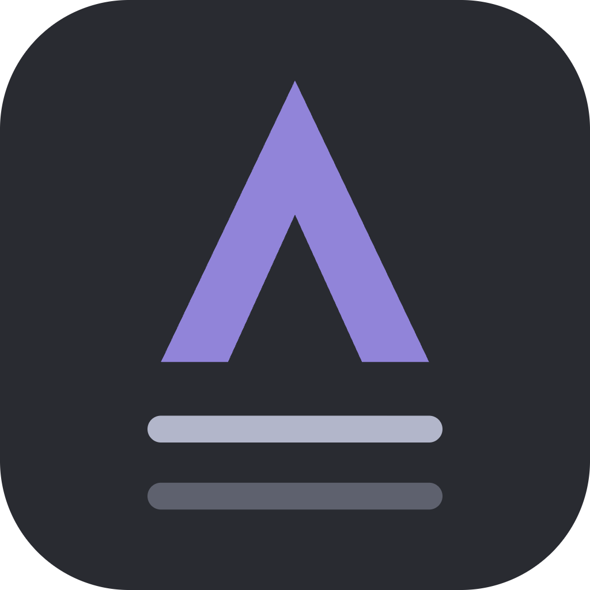
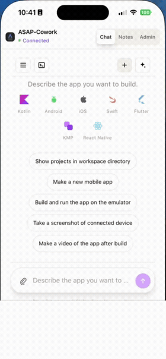
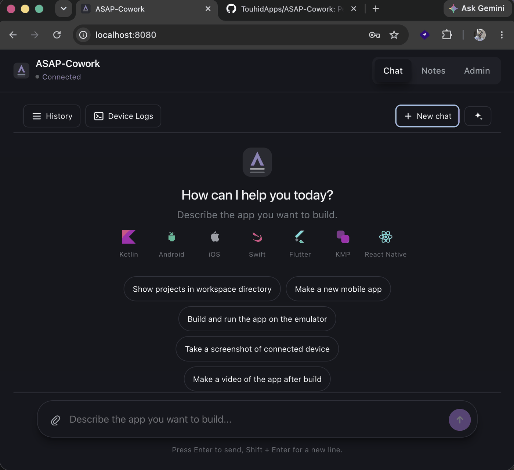
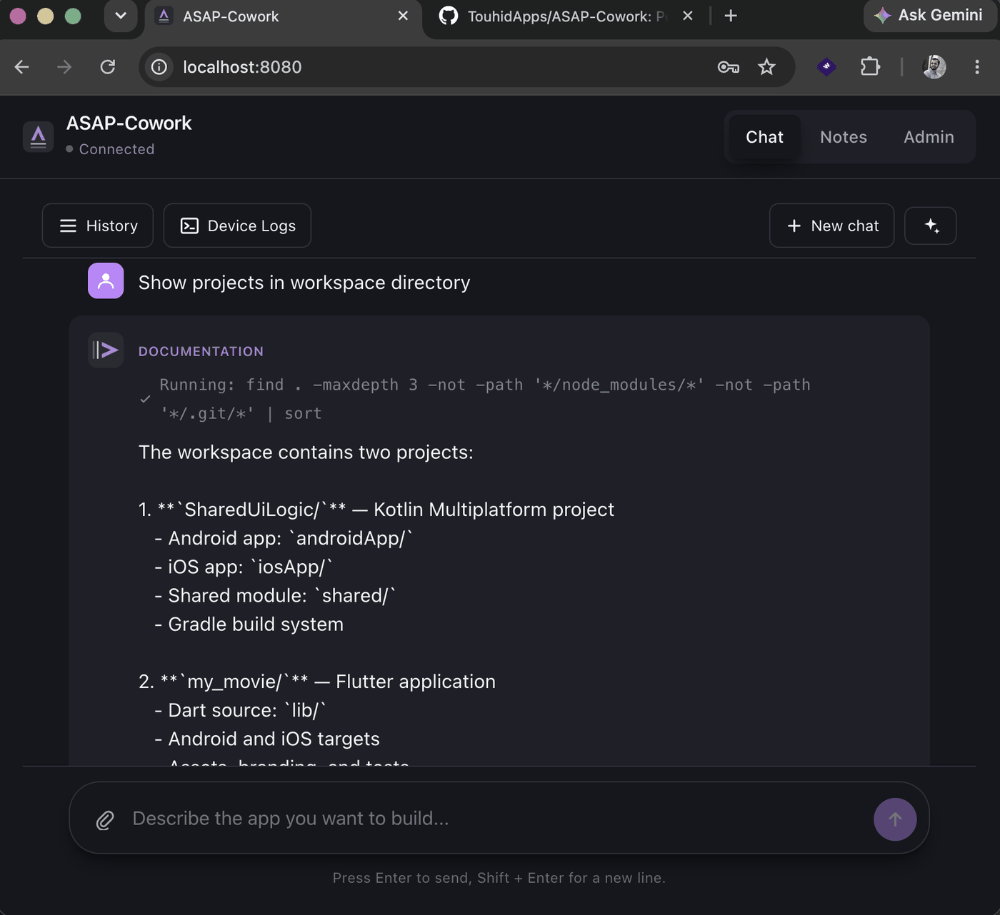
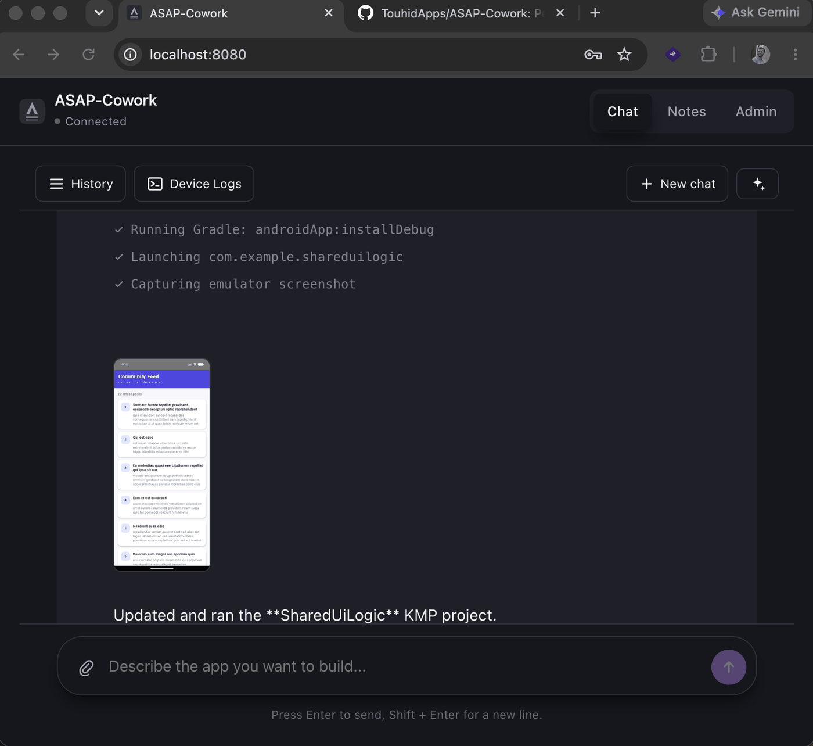

<div align="center">
  

  # ASAP-Cowork

  **An AI agent platform that takes a mobile app from idea to production.**

  Planning · Branding · Scaffolding · Coding · Testing · Debugging · Shipping — for Kotlin/Android, Swift/iOS, Kotlin Multiplatform, Flutter, and React Native.

  [](LICENSE)
  [](https://kotlinlang.org)
  [](https://ktor.io)
  [](https://react.dev)
  [](#project-status)
  [](#contributing)

</div>

---

## Table of Contents

- [Demo](#demo)
- [Overview](#overview)
- [Features](#features)
- [Architecture](#architecture)
- [Tech Stack](#tech-stack)
- [Project Structure](#project-structure)
- [Getting Started](#getting-started)
  - [Prerequisites](#prerequisites)
  - [Quick Start (automated setup script)](#quick-start-automated-setup-script)
  - [Manual Setup (step by step)](#manual-setup-step-by-step)
- [Running from a Packaged Jar](#running-from-a-packaged-jar)
- [Configuration](#configuration)
- [Project Status](#project-status)
- [Contributing](#contributing)
- [License](#license)

## Demo



<p float="left">
  
  
  
</p>

## Overview

ASAP-Cowork is a multi-agent AI platform for mobile app developers. Instead of a single chat bot bolted onto an IDE, it models the job as a team of specialist agents — one for requirements, one for Android, one for testing, one for debugging, one for publishing, and so on — coordinated by an orchestrator that keeps a persistent understanding of your project so follow-up requests ("add dark mode") are understood in context instead of treated as a fresh prompt.

It's designed to cover the **full lifecycle** of building a mobile app:

- Planning and product design
- Logo and branding generation
- Project scaffolding across native and cross-platform stacks (Kotlin, Swift, KMP, Flutter, React Native)
- Terms & Conditions / legal document generation
- Landing page generation
- Converting screenshots into Play Console–ready store images
- Writing test cases
- Running and debugging on an emulator, including reading logcat output
- Capturing screenshots and video from the emulator
- Uploading builds to Firebase App Distribution and Google Play Console

All of it is driven through a single streaming chat UI.

## Features

- 🧠 **Multi-agent orchestration** — a central orchestrator decomposes your request, routes it to the right specialist agent(s), and streams back progress live instead of a single blocking response.
- 📱 **Multi-SDK support** — Kotlin/Android, Swift/iOS, Kotlin Multiplatform, Flutter, and React Native, plus Spring Boot/Node backends.
- 🔌 **Multi-provider LLM gateway** — switch between Anthropic Claude, OpenAI, Google Gemini, or a local Ollama model, per agent, at any time.
- 🛠️ **Real tool integrations** — Gradle, `xcodebuild`, Flutter CLI, ADB, iOS Simulator (`simctl`), Firebase CLI — the agents drive actual developer tooling rather than simulating it.
- 🖥️ **Isolated build execution** — a dedicated `build-runner` service owns all builds, emulator, and device access, keeping untrusted/generated code execution away from the orchestrator process.
- 💬 **Streaming chat UI** — a React front end that renders agent activity, file diffs, and live logs (e.g. logcat) incrementally over WebSockets.
- 📦 **Runs anywhere** — as a set of dev processes via one script, or as a self-contained packaged jar a non-technical user can double-click.

## Architecture

ASAP-Cowork is built as a Kotlin multi-module monolith, designed so any agent can later be extracted into its own deployable service without changing how the rest of the system talks to it.

```
              ┌─────────────┐        ┌──────────────┐
   Browser ── │  web-ui     │──WS───▶│ chat-gateway │
              │  (React)    │        │  (Ktor)      │
              └─────────────┘        └──────┬───────┘
                                             │
                                   ┌─────────▼──────────┐
                                   │ orchestrator-core   │
                                   │ (ProjectContext,    │
                                   │  routing, tasks)    │
                                   └─────────┬──────────┘
                                             │ Agent contract (agent-sdk)
                    ┌────────────────────────┼────────────────────────┐
                    ▼                        ▼                        ▼
             android-agent            flutter-agent         publishing-agent  ...
                    │                        │                        │
                    └────────────┬───────────┴────────────┬───────────┘
                                 ▼                        ▼
                        tool-integrations          llm-gateway
                     (Gradle, ADB, simctl,      (Claude / OpenAI /
                      Firebase, Play Console)     Gemini / Ollama)
                                 │
                                 ▼
                          build-runner
                (isolated builds, emulators, device access)
```

Agents are **stateless workers** — all persistent project understanding lives in the orchestrator's `ProjectContext`, backed by `context-store`. Every agent implements the same `Agent` interface and declares the capabilities it handles, so the orchestrator only activates the agents relevant to your project (a pure Flutter project never wakes the Android or iOS agents).

For the full architectural rationale, module breakdown, and phased roadmap, see [`PLAN.md`](PLAN.md).

## Tech Stack

| Layer | Technology |
|-------|------------|
| Orchestrator & agents | Kotlin, coroutines/Flow for streaming |
| API / chat server | [Ktor](https://ktor.io) (WebSocket + REST) |
| Frontend | [React](https://react.dev) + TypeScript + Vite, WebSocket streaming chat |
| LLM providers | Anthropic Claude, OpenAI, Google Gemini, Ollama (local) — behind one provider interface, switchable per agent |
| Persistence | Exposed ORM over SQLite (local-first) |
| Build / emulator execution | Dedicated `build-runner` service, isolated from the orchestrator process |
| Build tool | Gradle (Kotlin DSL, multi-module) |
| Mobile targets | Kotlin/Android, Swift/iOS, Kotlin Multiplatform, Flutter, React Native |
| Backend targets | Spring Boot (Kotlin/Java), Node.js |
| Distribution | Firebase App Distribution API, Google Play Developer API |

## Project Structure

```
asap-cowork/
├── orchestrator-core/          # Project fingerprinting, ProjectContext, task routing
├── agent-sdk/                  # Agent interface + Task/AgentEvent/Capability contracts
├── agents/                     # One module per specialist agent
│   ├── requirements-agent/
│   ├── architecture-advisor-agent/
│   ├── techstack-agent/
│   ├── scaffolding-agent/
│   ├── android-agent/
│   ├── ios-agent/
│   ├── kmp-agent/
│   ├── flutter-agent/
│   ├── react-native-agent/
│   ├── backend-agent/
│   ├── testing-agent/
│   ├── debugging-agent/
│   ├── cicd-agent/
│   ├── publishing-agent/
│   ├── branding-agent/
│   ├── legal-doc-agent/
│   ├── landing-page-agent/
│   ├── store-asset-agent/
│   ├── documentation-agent/
│   ├── analytics-agent/
│   ├── security-review-agent/
│   ├── performance-agent/
│   └── notes-agent/
├── tool-integrations/          # Thin clients over Gradle, ADB, xcodebuild, Firebase, etc.
├── context-store/              # ProjectContext persistence (Exposed/SQLite)
├── llm-gateway/                # Multi-provider LLM access, prompt templates
├── build-runner/               # Isolated build/emulator/device execution service
├── chat-gateway/                # Ktor WebSocket/REST server, bundles the built web-ui
├── web-ui/                      # React chat application
├── packaging/                   # Launcher scripts and README for the packaged distribution
└── asap.sh                      # One-command dev setup + run script
```

## Getting Started

### Prerequisites

| Requirement | Needed for | Notes |
|---|---|---|
| **Java 21+** | Everything | e.g. [Adoptium Temurin](https://adoptium.net) |
| **Node.js + npm** | `web-ui` | Required to build/run the React front end |
| **Git** | Cloning the repo | — |
| **Android SDK** (`adb`, emulator) | Android agent / debugging tools | Optional if you're not targeting Android |
| **Xcode** (macOS only) | iOS agent | Optional if you're not targeting iOS |
| **Flutter SDK** | Flutter agent | Optional if you're not targeting Flutter |
| **Firebase CLI** | Publishing to Firebase App Distribution | Optional |
| At least one **LLM API key** | Chat to actually respond | Anthropic, OpenAI, or Gemini — or run a local [Ollama](https://ollama.com) model instead |

### Quick Start (automated setup script)

The included `asap.sh` script automates environment setup on macOS (installing Homebrew, Java, Gradle, the Android SDK, Node, Firebase CLI, etc. as needed) and gives you a one-command way to run everything.

```bash
# 1. Clone the repository
git clone https://github.com/touhidapps/ASAP-Cowork.git
cd ASAP-Cowork

# 2. Run the setup check (installs missing prerequisites, creates .env from .env.example)
./asap.sh
# → choose option 3 (ASAP Cowork Setup)

# 3. Start everything (build-runner + chat-gateway backend + web-ui dev server)
./asap.sh
# → choose option 1 (Run All)
```

Once running, open **http://localhost:8080** in your browser.

> Option 2 in the menu additionally exposes the UI publicly over your Tailscale network via Tailscale Funnel — useful for testing from a phone.

### Manual Setup (step by step)

If you're not on macOS, or prefer to do it yourself:

1. **Install prerequisites** — JDK 21+, Node.js/npm, and (optionally) the Android SDK / Xcode / Flutter SDK for the platforms you plan to target.

2. **Clone the repository**
   ```bash
   git clone https://github.com/touhidapps/ASAP-Cowork.git
   cd ASAP-Cowork
   ```

3. **Configure environment variables**
   ```bash
   cp .env.example .env
   ```
   Edit `.env` and set at least one LLM provider API key (see [Configuration](#configuration) below).

4. **Install web UI dependencies**
   ```bash
   cd web-ui
   npm install
   cp .env.example .env
   cd ..
   ```

5. **Make the Gradle wrapper executable** (first run only)
   ```bash
   chmod +x gradlew
   ```

6. **Start `build-runner`** (owns all builds/emulator/device execution) — in one terminal:
   ```bash
   ./gradlew :build-runner:run
   ```
   Wait until it responds on `http://localhost:8090/health`.

7. **Start `chat-gateway`** (the backend chat/API server) — in a second terminal:
   ```bash
   ./gradlew :chat-gateway:run
   ```
   Wait until it responds on `http://localhost:8081/health`.

8. **Start the web UI** — in a third terminal:
   ```bash
   cd web-ui
   npm run dev
   ```

9. **Open the app** at **http://localhost:8080** (the Vite dev server proxies `/api`, `/health`, and `/ws` to the backend on `:8081`).

## Running from a Packaged Jar

For end users who just want to run the app without a source checkout, Node/npm, or Gradle, the root build produces a self-contained distribution: two runnable "fat" jars (with the built web UI bundled directly into `chat-gateway`'s jar), plus launcher scripts.

> **Note:** this distribution is a *build output* (`build/dist/`), so it's not checked into the repo and isn't attached anywhere yet — check the [Releases](https://github.com/touhidapps/ASAP-Cowork/releases) page first in case a ready-to-download zip has since been published. If you don't see one there, build it yourself with the steps below (only step 1 requires a source checkout/Gradle/Node — the rest is just running the jars).

### 1. Build the distribution

From the repo root (requires JDK 21+ and Node/npm, since it builds the web UI as part of the process):

```bash
./gradlew assembleDist
```

This produces a ready-to-run folder at `build/dist/asap-cowork/` containing:

```
asap-cowork/
├── build-runner-all.jar
├── chat-gateway-all.jar
├── .env.example
├── start.sh          # macOS / Linux (terminal)
├── start.command      # macOS (double-click in Finder)
├── start.bat           # Windows (double-click)
└── README.md            # End-user instructions
```

To produce a zip instead (e.g. for distributing to someone else), run `./gradlew distZip` — the archive lands in `build/dist/asap-cowork.zip`.

### 2. Configure it

```bash
cd build/dist/asap-cowork
cp .env.example .env
```

Edit `.env` and set at least one LLM provider API key.

### 3. Run it

Only a **Java 21+ runtime** is required on the machine running this folder — no Gradle, Node, or source checkout needed.

- **macOS:** double-click `start.command`, or run `./start.sh` in a terminal.
- **Windows:** double-click `start.bat`.
- **Linux:** run `./start.sh` in a terminal.

This starts `build-runner` and `chat-gateway` and opens your browser automatically at **http://localhost:8081** once it's ready. To stop, close the terminal window (Ctrl+C on macOS/Linux); on Windows also close the separate build-runner console window.

Generated projects are written to a `workspace/` folder next to the jars; chat history and settings live in a `data/` folder next to them — both safe to back up or delete for a clean slate.

## Configuration

All configuration lives in a single `.env` file at the repo root (or next to the jars in the packaged distribution). See [`.env.example`](.env.example) for the full list; the key ones:

| Variable | Purpose |
|---|---|
| `ANTHROPIC_API_KEY` / `OPENAI_API_KEY` / `GEMINI_API_KEY` | LLM provider credentials — set at least one |
| `OLLAMA_HOST` / `OLLAMA_MODEL` | Point at a local Ollama server instead of a hosted provider (no API key needed) |
| `ADMIN_TOKEN` | Bearer token protecting the admin panel |
| `WORKSPACE_ROOT_PATH` | Where generated projects are written (defaults to `./workspace`) |
| `FIREBASE_APP_ID` / `FIREBASE_CI_TOKEN` / `FIREBASE_TESTER_GROUPS` / `FIREBASE_RELEASE_NOTES` | Firebase App Distribution publishing — configurable from the admin panel instead |
| `ALLOWED_HOSTS` | Extra hosts allowed to call the server (CORS) — e.g. a phone on Tailscale |

## Project Status

ASAP-Cowork is under **active development**, being built out module by module against the phased roadmap in [`PLAN.md`](PLAN.md): foundation → planning agents → platform development agents → quality loop (testing/debugging) → ship loop (CI/CD, publishing, store assets) → phase 2 expansion (docs, analytics, security, performance). Expect rapid iteration and breaking changes while the core agent set is being built out.

## Contributing

Contributions, issues, and feature requests are welcome!

1. Fork the repository and create a feature branch.
2. Read [`PLAN.md`](PLAN.md) for the architectural rules the project follows (agents are stateless workers, one capability per module, no cross-agent dependencies).
3. Make your changes, following the existing module structure — new agents live under `agents/` and depend only on `agent-sdk`.
4. Open a pull request describing what changed and why.

If you're planning a larger change, please open an issue first to discuss the approach.

## License

Distributed under the **MIT License**. See [`LICENSE`](LICENSE) for the full text.
